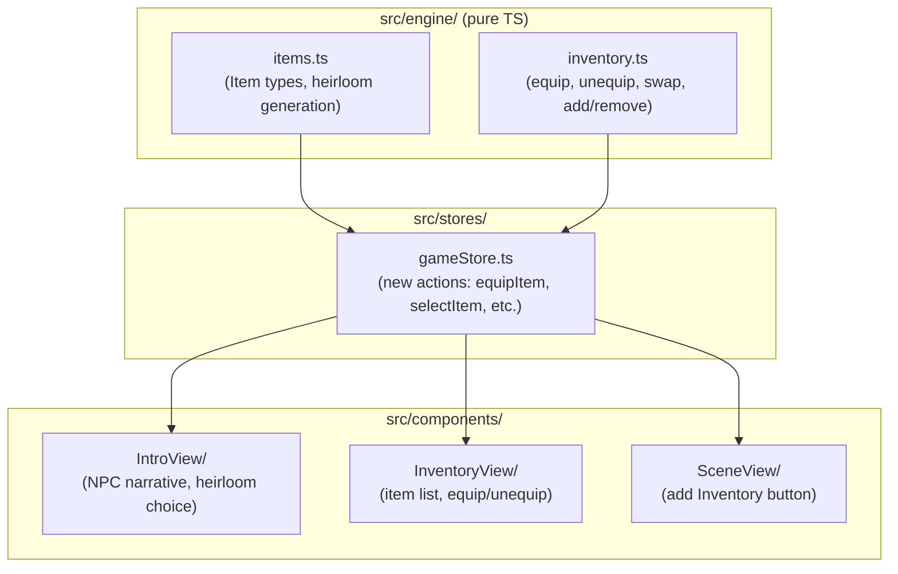

# Phase 3: Items, Inventory & Starting Narrative

## Current State

Phases 1 and 2 are complete. The codebase has:

- World generation, movement, rest, search mechanics in `src/engine/`
- Zustand store in `src/stores/gameStore.ts` bridging engine to UI
- SceneView and MapView components with slide transitions
- IndexedDB persistence via `src/utils/persistence.ts` (auto-save on every state change)
- `Player` type has position, AP, wounds, name, level -- but no inventory or equipment fields
- `GamePhase` is `'exploring' | 'combat' | 'resting'` -- no intro/narrative phase

## Architecture

Following [ADR 0003](../adr/0003-game-engine-separation.md), all new game logic goes in `src/engine/` as pure TypeScript. The Zustand store wires engine functions to the UI. New UI components are thin rendering layers.

---

## Task 3a: Item Type Definitions

**File:** `src/engine/types.ts`

Add the following types alongside existing definitions:

- `ItemCategory` const object: `'melee' | 'ranged' | 'magic'` -- generic weapon classes, not tied to specific items (Sword is melee, Bow is ranged, Wand is magic)
- `Item` interface: `{ id: string, name: string, category: ItemCategory, description: string, attackPower: number, flavourText: string }`
- `Inventory` interface: `{ items: Item[], equippedItemId: string | null, maxSlots: number }`
- Add `inventory: Inventory` field to the existing `Player` interface
- Add `AP_COST_SWAP` constant (equal to `DEFAULT_MAX_AP`, i.e. a full turn)

**File:** `src/engine/types.ts` -- also add `'intro'` to `GamePhase` union for the starting narrative.

---

## Task 3b: Item Definitions & Heirloom Generation

**New file:** `src/engine/items.ts`

- Define a pool of heirloom items per category (2-3 variants each for melee, ranged, magic) with thematic names/descriptions fitting the cosy aesthetic (e.g. "Bramblewood Sword" for melee, "Thornwood Bow" for ranged, "Ember Wand" for magic)
- `generateHeirloomChoices(rng: () => number): [Item, Item, Item]` -- picks one random item from each category, assigns unique IDs
- Each heirloom has balanced but distinct stats (melee: higher attack; ranged: medium attack + range flavour; magic: lower attack but hints at future utility/magic skills)

**Tests:** `tests/engine/items.test.ts` -- generates choices, verifies 3 items returned, one per category, valid IDs

---

## Task 3c: Inventory Engine Logic

**New file:** `src/engine/inventory.ts`

Pure functions operating on `Player`:

- `createEmptyInventory(maxSlots?: number): Inventory` -- default 5 slots
- `addItem(player: Player, item: Item): { success: boolean, player: Player, reason?: string }` -- fails if inventory full
- `removeItem(player: Player, itemId: string): { success: boolean, player: Player, reason?: string }` -- fails if item is currently equipped
- `equipItem(player: Player, itemId: string): { success: boolean, player: Player, reason?: string }` -- item must be in inventory; swaps out current equipment
- `unequipItem(player: Player): { success: boolean, player: Player }` -- sets `equippedItemId` to null
- `swapEquipment(player: Player, itemId: string): { success: boolean, player: Player, reason?: string }` -- costs all AP (`AP_COST_SWAP`). Fails if `player.ap < player.maxAp` (must have full AP, i.e. it consumes the entire turn). On success, equips the new item and sets `ap` to 0.
- `getEquippedItem(player: Player): Item | null` -- helper to look up the equipped item

**Tests:** `tests/engine/inventory.test.ts` -- equip/unequip, full-turn swap AP cost, inventory full rejection, remove-while-equipped rejection

---

## Task 3d: Zustand Store Updates

**File:** `src/stores/gameStore.ts`

New actions in `GameActions`:

- `selectItem(itemId: string)` -- general-purpose action for choosing an item from a set of offered choices (heirloom intro, future chests, etc.). Adds the chosen item to inventory, equips it if nothing is equipped, and transitions game phase as appropriate (e.g. `'intro'` to `'exploring'`)
- `equipItem(itemId: string)` -- wraps `inventory.equipItem`
- `unequipItem()` -- wraps `inventory.unequipItem`
- `swapEquipment(itemId: string)` -- wraps `inventory.swapEquipment` (full-turn cost)
- `openInventory()` / `closeInventory()` -- or extend `ViewMode` to `'scene' | 'map' | 'inventory' | 'intro'`

New derived:

- `equippedItem()` -- returns the currently equipped `Item | null`

Update `initGame` / `newGame`:

- Set initial `gamePhase` to `'intro'` instead of `'exploring'`
- Generate heirloom choices and store them in state (new field `offeredItems: Item[]` -- generic name, reusable for chests/loot in future phases)
- Create player with `createEmptyInventory()`

Update `createInitialPlayer` to include an empty `inventory` field.

**File:** `src/utils/persistence.ts` -- add `inventory` (as part of `player`) and `offeredItems` to `SaveData`. Since `Player` already includes the inventory field, this mostly just works. Note in a new ADR if schema migration is needed.

**Tests:** `tests/stores/gameStore.test.ts` -- extend with selectItem flow, equip/swap actions

---

## Task 3e: Intro/Narrative View Component

**New directory:** `src/components/IntroView/`

- `IntroView.tsx` + `IntroView.module.css` + `index.ts`
- Narrative text: a warm, cosy NPC greeting ("An old badger adjusts her spectacles...") offering three heirlooms
- Display 3 heirloom cards showing name, category icon/label, attack power, flavour text
- Tapping a card calls `selectItem(itemId)` which transitions to exploring
- Styled with the existing cosy theme (parchment background, serif fonts, page-turn transition in)
- Mobile-first: single column, large tap targets

**Tests:** `tests/components/IntroView.test.tsx` -- renders 3 choices, clicking one transitions to exploring phase

---

## Task 3f: Inventory View Component

**New directory:** `src/components/InventoryView/`

- `InventoryView.tsx` + `InventoryView.module.css` + `index.ts`
- Lists all items in player's inventory with name, category, attack power
- Equipped item is visually highlighted (border/badge)
- Tap an unequipped item to see [Equip] and [Swap (Full Turn)] options:
  - [Equip] available outside combat when no item is equipped
  - [Swap] available anytime but costs full AP; shows AP cost warning
- Tap equipped item to see [Unequip] option
- Close button returns to SceneView
- Mobile-first: stacked list layout, comfortable spacing

**Tests:** `tests/components/InventoryView.test.tsx` -- renders items, equip/unequip buttons, swap shows AP warning

---

## Task 3g: App Shell & SceneView Updates

**File:** `src/App.tsx`

- Add `'inventory'` and `'intro'` to `ViewMode` (in `gameStore.ts`)
- Render `IntroView` when `gamePhase === 'intro'` (before the scene/map views)
- Render `InventoryView` alongside SceneView/MapView in the view container
- Adjust the sliding transition logic to support the additional views

**File:** `src/components/SceneView/SceneView.tsx`

- Add an [Inventory] button to the footer actions (between Map and Search)
- Show the currently equipped item name in the HUD (if any)

---

## Task 3h: Persistence & ADR

- Verify `SaveData` correctly serialises the new `Player.inventory` and `offeredItems` fields
- Add `docs/adr/0006-item-inventory-system.md` documenting the design: item-locked skills (forward-looking), full-turn swap cost rationale, inventory slot limits

---

## Git Workflow

Per [ADR 0004](../adr/0004-git-workflow.md), work on branch `feat/phase-3-items-inventory` with one commit per task:

1. `feat: add item, inventory, and heirloom type definitions` (3a)
2. `feat: implement heirloom item pool and random generation with tests` (3b)
3. `feat: implement inventory engine logic with equip, swap, and tests` (3c)
4. `feat: wire inventory and item selection actions into Zustand store with tests` (3d)
5. `feat: implement intro narrative view with heirloom selection` (3e)
6. `feat: implement inventory view component with equip/swap UI` (3f)
7. `feat: update app shell and scene view with inventory button and intro flow` (3g)
8. `feat: update persistence for inventory data and add ADR 0006` (3h)
