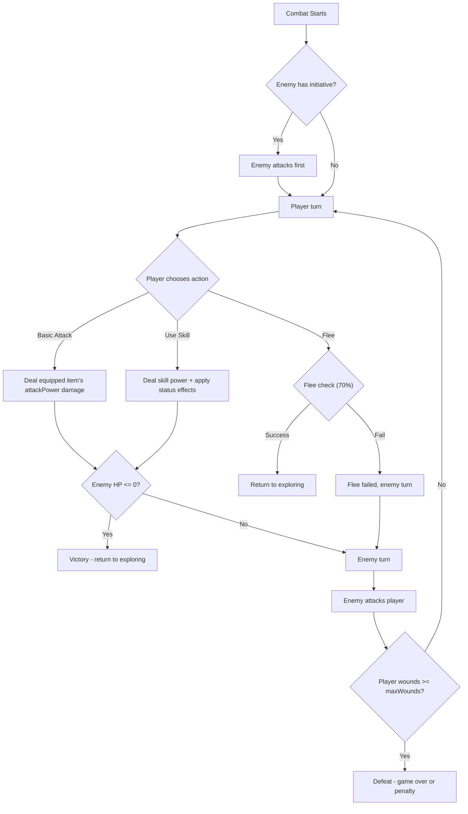

# Phase 4: Skills and Combat

## Current State

- **Combat infrastructure is minimal**: `gamePhase === 'combat'` and `ActiveEnemy` (name, strength, hasInitiative) exist, but there is no combat resolution logic. The only way to enter combat is via a rest ambush, and once in combat the player is stuck with no actions available.
- **No skill system**: No `Skill` type, no skill definitions, no active skill slots.
- **Enemies are trivial**: Three hardcoded ambush enemies in `src/engine/rest.ts` (all strength 1). No enemy placement during world generation. `Tile` has no `enemyData`.
- **Items have unused combat stats**: `Item.attackPower` and `Item.category` exist but are not used in any calculation.

## Architecture Approach

Following the established pattern (ADR 0003):
1. Pure engine modules first (`src/engine/skills.ts`, `src/engine/enemies.ts`, `src/engine/combat.ts`)
2. Zustand store actions second (`src/stores/gameStore.ts`)
3. React UI last (extend SceneView, add SkillsView)

Save data migration from v2 to v3 via the versioned pipeline in `src/utils/persistence.ts` (ADR 0008).

## Data Model Changes

### New types in `src/engine/types.ts`

```typescript
export type SkillCategory = 'offensive' | 'defensive' | 'utility'
export type StatusEffectType = 'daze' | 'poison' | 'shield'

export interface StatusEffect {
  type: StatusEffectType
  remainingTurns: number
}

export interface Skill {
  id: string
  name: string
  description: string
  skillCategory: SkillCategory
  requiredItemCategory: ItemCategory
  apCost: number
  effect: SkillEffect
}

export type SkillEffect =
  | { type: 'damage'; power: number }
  | { type: 'damage_status'; power: number; statusEffect: StatusEffectType; duration: number }
  | { type: 'status'; statusEffect: StatusEffectType; duration: number }
  | { type: 'dodge_next'; chance: number }
```

### Extended existing types

- **`Player`**: add `unlockedSkillIds: string[]`, `activeSkillIds: string[]`, `maxActiveSkills: number` (default 2)
- **`ActiveEnemy`**: add `hp: number`, `maxHp: number`, `statusEffects: StatusEffect[]`
- **`Tile`**: add optional `enemyId?: string` for tile-based encounters
- **Constants**: `AP_COST_ATTACK = 1`, `AP_COST_FLEE = 1`, `BASE_FLEE_CHANCE = 0.7`

### Save migration (v2 to v3)

In `src/utils/persistence.ts`, add migration `2`:
- Backfill `player.unlockedSkillIds: []`, `player.activeSkillIds: []`, `player.maxActiveSkills: 2`
- Backfill `activeEnemy.hp = activeEnemy.strength`, `activeEnemy.maxHp = activeEnemy.strength`, `activeEnemy.statusEffects = []` (if activeEnemy exists)
- Bump `CURRENT_SAVE_VERSION` to 3

## Combat Flow



## Task Breakdown

### 4a. Type definitions and skill data

- Add all new types to `src/engine/types.ts` (Skill, SkillEffect, StatusEffect, SkillCategory, StatusEffectType, new constants)
- Extend `Player`, `ActiveEnemy`, `Tile` with new fields
- Create `src/engine/skills.ts` with a `SKILL_REGISTRY` containing ~9 skills (3 per item category):
  - **Melee**: Heavy Strike (high damage), Daze Slam (damage + daze), Parry (defensive dodge)
  - **Ranged**: Precision Shot (high damage), Pin Down (damage + daze), Quick Dodge (defensive dodge)
  - **Magic**: Arcane Bolt (damage), Hex (status: poison), Mystic Shield (defensive shield)
- Pure functions: `getAvailableSkills(player)`, `canUseSkill(player, skillId)`, `unlockSkill(player, skillId)`, `setActiveSkills(player, skillIds)`
- Tests in `tests/engine/skills.test.ts`

### 4b. Enemy system and world generation

- Create `src/engine/enemies.ts` with an `ENEMY_REGISTRY` of ~8 enemy templates with biome associations, varying strength/HP:
  - Forest: Shadow Wolf (str 1, hp 2), Thorn Sprite (str 1, hp 1)
  - Meadow: Bandit Rat (str 1, hp 2), Wild Boar (str 2, hp 3)
  - Swamp/Thicket: Marsh Serpent (str 2, hp 2)
  - Mountain: Stone Golem (str 3, hp 4)
  - Road: Highwayman Fox (str 2, hp 3)
  - Any: Wandering Shade (str 2, hp 2)
- Pure function: `createActiveEnemy(template, hasInitiative): ActiveEnemy`
- Update `src/engine/world.ts` to optionally place `enemyId` on tiles during generation (sparse, ~10-15% of passable non-village tiles)
- Update `src/engine/rest.ts` to use the enemy registry instead of hardcoded list
- Add encounter trigger: a function `checkTileEncounter(tile, rng): ActiveEnemy | null` that resolves whether entering a tile starts combat
- Tests in `tests/engine/enemies.test.ts`

### 4c. Combat engine

- Create `src/engine/combat.ts` with pure functions:
  - `playerBasicAttack(player, enemy): CombatActionResult` -- costs 1 AP, damage = equipped item attackPower
  - `playerSkillAttack(player, enemy, skill): CombatActionResult` -- costs skill AP, applies skill effect
  - `enemyTurn(enemy, player): EnemyTurnResult` -- enemy attacks, applies wound to player (skipped if dazed)
  - `attemptFlee(player, rng): FleeResult` -- costs 1 AP, 70% success
  - `tickStatusEffects(effects): StatusEffect[]` -- decrement durations, remove expired
  - `getCombatOutcome(player, enemy): 'ongoing' | 'victory' | 'defeat'`
- Damage rules:
  - Player deals damage = attackPower (basic) or skill power (skill). Status effects (daze, poison) applied if skill specifies
  - Dazed enemies skip their attack for the turn
  - Poison deals 1 damage per turn to enemy at start of player turn
  - Shield negates 1 wound from enemy attack, then expires
  - Enemy deals damage = strength, each hit inflicts 1 wound
- Tests in `tests/engine/combat.test.ts`

### 4d. Store integration

- Add store actions: `attack()`, `useSkill(skillId)`, `flee()`, `unlockSkill(skillId)`, `setActiveSkills(skillIds[])`
- Wire `movePlayer` to call `checkTileEncounter` on the destination tile, entering combat if enemy present
- After player combat action, auto-resolve enemy turn (sequential within the same action) and update state
- On victory: clear `activeEnemy`, return to `exploring`, show victory message
- On defeat: implement a "retreat" penalty (for now just reset to village with full wounds)
- On flee success: return to `exploring`, move player back to previous tile
- Extend `SaveData` with player skill fields; add migration v2 to v3
- Update `extractSaveData` to include new fields
- Tests in `tests/stores/gameStore.test.ts` (extend existing)

### 4e. Combat UI (SceneView)

- Replace the combat banner in `src/components/SceneView/SceneView.tsx` with a full combat panel:
  - Enemy name, HP bar, status effect icons
  - Combat action buttons: [Attack], [Flee], plus one button per active skill (greyed if wrong item equipped or not enough AP)
  - Combat log (last 3-5 messages shown as a scrollable list)
  - Disable non-combat actions (Map, Search, Rest) during combat; keep End Turn
- Add CSS styles for the combat panel in `SceneView.module.css`
- Tests in `tests/components/SceneView.test.tsx` (extend existing)

### 4f. Skills management UI

- Create `src/components/SkillsView/SkillsView.tsx` accessible from the inventory or a new [Skills] button in SceneView
- Show unlocked skills grouped by item category, with active/inactive toggle
- Indicate which skills are usable based on currently equipped item
- Enforce `maxActiveSkills` limit in the UI
- Add `ViewMode` option `'skills'` to the store
- CSS module `SkillsView.module.css`
- Tests in `tests/components/SkillsView.test.tsx`

### 4g. ADR and git workflow

- Write `docs/adr/0009-skills-combat-system.md` documenting the skill-locking, combat flow, and status effect design decisions
- Branch: `feat/phase-4-skills-combat` with one commit per task (4a through 4f)

## Key Files Modified

- `src/engine/types.ts` -- new types, extended Player/ActiveEnemy/Tile
- `src/engine/rest.ts` -- use enemy registry
- `src/engine/world.ts` -- enemy placement
- `src/stores/gameStore.ts` -- combat + skill actions, encounter on move
- `src/utils/persistence.ts` -- migration v2 to v3
- `src/components/SceneView/SceneView.tsx` -- combat UI

## New Files

- `src/engine/skills.ts` -- skill registry and skill logic
- `src/engine/enemies.ts` -- enemy templates and encounter logic
- `src/engine/combat.ts` -- combat resolution engine
- `src/components/SkillsView/SkillsView.tsx` + CSS module -- skill management UI
- `tests/engine/skills.test.ts`, `tests/engine/enemies.test.ts`, `tests/engine/combat.test.ts`, `tests/components/SkillsView.test.tsx`
- `docs/adr/0009-skills-combat-system.md`
